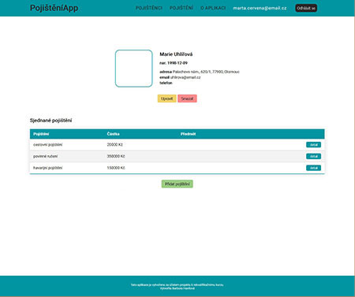
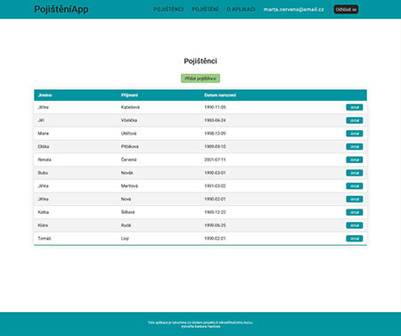

# Simple insurance App

This simple web application allows users to manage persons and insurance 
information. The application is built using Node.js, Express, MongoDB, 
Express Session for session management, Joi for data validation, Bcrypt for
password hashing, and EJS templates for rendering views. To run this 
application, you will need to have the following npm libraries installed.

 

## Dependencies

* Node.js
* Express
* Express-session
* Body-parser
* Mongooose
* Joi
* Bcrypt
* EJS

## Configuration

Before running the application, you need to configure your environment variables. In app.js file pass into secret key, your own session key:

```javascript
app.use(expressSession({
    secret: `${sessionKey}`
    ...
```

## Usage

To run app, use following command:

```
node app.js
```

The app will be accessible at **'http://localhost:8080'** in your web browser.

## Functionality 

* User registration
* User login
* Admin access
* View information
* Add, edit and delete data

## License 

This project is licensed under the MIT License. See the LICENSE file for details.